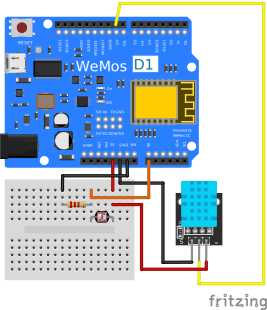
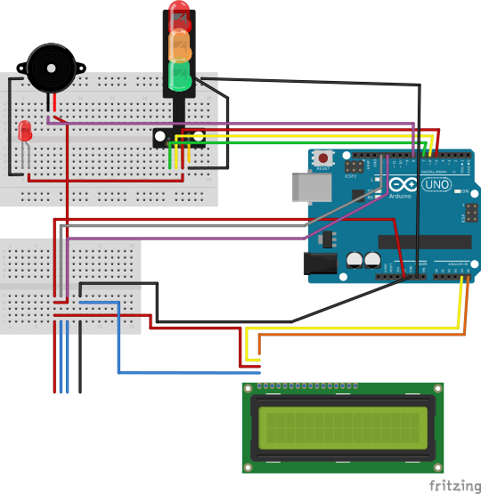
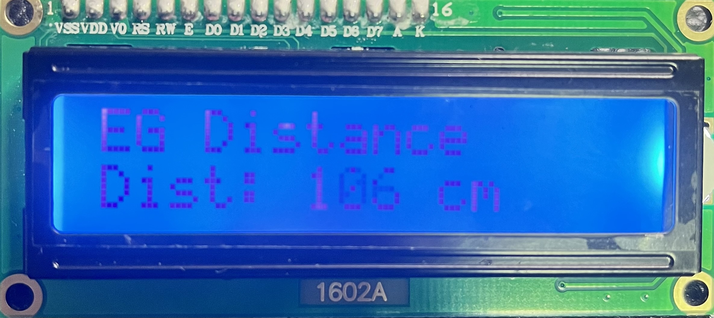

# Elder-Guardian
Developed by Cyan with ❤️  

[](https://github.com/hoony6134/Elder-Guardian) <a href='https://github.com/shivamkapasia0' target="_blank"></a> [](/CONTRIBUTING.md "Go to contributions doc") <br>
<a href='https://github.com/shivamkapasia0' target="_blank"></a> <a href='https://github.com/shivamkapasia0' target="_blank"></a> <a href='https://github.com/shivamkapasia0' target="_blank"></a>
## "Elder Guardian"이란?
Elder Guardian은 낯선 사람의 접근과 예기치 않은 낙상으로부터 어르신들을 보호하기 위한 프로젝트입니다. 본 프로젝트는 "서버 측"과 "센서 측"이라는 두 개의 아두이노 보드를 기반으로 하며, 센서용 아두이노 UNO 보드 1개와 Wi-Fi 서버용 WeMos R1 D1 보드 1개를 사용합니다.
## 서버 장치
### "서버 장치"란?
서버 장치는 DHT11(습도 및 온도 센서), 조도 센서, 내장 Wi-Fi 모듈이 연결된 WeMos R1 D1 보드 기반의 보드입니다. 이 보드는 인터넷에 연결되어 서버에 연결된 클라이언트에 데이터를 전송합니다. 노트북/데스크탑에 연결하면 기본 로컬 IP 주소가 시리얼 모니터에 표시되며, nmap 또는 기타 네트워크 스캐너를 사용하여 호스트의 IP 주소를 찾을 수 있습니다.
### "서버 장치" 제작 및 사용법
1. 다음 부품을 준비합니다:
    - WeMos R1 D1 보드
    - DHT11 센서
    - 저항(갈색 - 검정색 - 빨간색 - 금색)
    - 점퍼선(M-F 약 3개, M-M 약 3개)
    - 브레드보드(소형 - 15홀 * 2 또는 소형 브레드보드)
    - 조도 센서
    - USB A - 마이크로 5핀 데이터/전원 케이블
    - 아두이노 IDE가 설치된 노트북 또는 데스크톱 컴퓨터
2. 회로 구성:   

3. 보드를 컴퓨터와 USB 케이블로 연결합니다.
4. [이 곳](server.ino)에서 코드를 다운받고, 컴퓨터에서 아두이노 IDE로 실행합니다.
5. SSID와 비밀번호를 사용중인 Wi-Fi의 SSID와 비밀번호(11번과 12번 줄)로 바꿉니다.
```cpp
char *ssid = "SSID"; // SSID
char *password = "PW"; // Password (공개 네트워크: "")
```
6. Arduino IDE를 사용하여 코드를 보드에 업로드합니다.
7. Serial Monitor(시리얼 모니터)를 열고 보드가 Wi-Fi에 연결될 때까지 기다립니다.
8. 연결되면 Serial Monitor에 로컬 IP 주소가 표시됩니다.
9. 이제 IP 주소를 사용하여 보드에 연결할 수 있습니다. 그 이후로, 컴퓨터는 더 이상 필요하지 않습니다.<br>
**참고:** 코드는 보드의 전원을 켜면 자동으로 실행되도록 설계되었으며 아이폰 13 화면에 맞게 설계되었습니다. Google 웹 폰트를 사용하여 텍스트를 표시하므로 보드를 사용하려면 인터넷에 연결해야 합니다. 또한 제 GitHub에서 호스팅하고 있는 경고음 파일을 사용하므로 낙상 감지 시 경고음을 사용하려면 인터넷에 연결해야 합니다.

## 센서 장치
### "센서 장치"란?
센서 장치는 HY-SRF05(또는 HC-SR04) 초음파 센서, 신호등 LED, Liquid Crystal 16x2 LCD Panel, Piezo Buzer, 적색 LED(옵션)에 연결된 Arduino UNO 보드 기반의 보드입니다. 서버 측과는 연결되지 않지만, 낯선 사람이 접근하는 것을 감지하고 어르신들에게 알려주는 기능을 제공합니다.

### "센서 장치" 제작 및 사용법
1. 다음 부품을 준비합니다:
    - 아두이노 UNO 보드
    - HY-SRF05(또는 HC-SR04) 초음파 센서
    - 신호등 LED
    - I2C 모듈이 있는 16x2 LCD 패널
    - 피에조 부저
    - 추가 적색 LED(옵션)
    - 저항(옵션)
    - 점퍼선(M-F 약 4개, M-M 약 15개)
    - 브레드보드(하프사이즈 1개, Tiny 1개)
    - Arduino UNO - USB A 데이터/전원 케이블
    - Arduino IDE가 설치된 노트북 또는 데스크톱 컴퓨터
2. 회로 구성:  

3. USB 케이블로 보드를 컴퓨터에 연결합니다.
4. [여기](sensor.ino)에서 코드를 다운로드하여 Arduino IDE로 엽니다.
5. Arduino IDE를 사용하여 코드를 보드에 업로드합니다.
6. 접근 감지 및 경고 기능을 사용할 준비가 완료되었습니다!

## "클라이언트"에서의 "서버" 사용법
1. 스마트폰 등의 기기에서 서버가 연결되어 있는 Wi-Fi에 연결합니다(또는 개인용 핫스팟 사용).
2. 웹브라우저에서 Serial Monitor 또는 nmap을 통해 얻은 서버의 IP 주소를 엽니다(스마트폰 화면 권장 - iPhone 13, Safari, iOS 17 Dev Beta 2에 완벽하게 적합하도록 설계됨).
3. 이제 서버의 데이터를 보고 보드를 사용할 수 있습니다.

## "센서"를 사용하는 방법?
1. 보드를 전원에 연결합니다(Power Bank 권장).
2. 보드가 부팅될 때까지 기다립니다.
3. 초음파 센서를 배낭이나 가방, 옷 등 부착하고자 하는 것의 뒷면에 부착합니다.
4. 신호등 LED 및 (선택) 적색 LED, LCD를 배낭 또는 가방, 옷 등에 부착합니다.
5. 보드를 안전한 장소에 보관합니다.
6. LCD 패널의 Ultra Sonic Sensor에서 낯선 사람(또는 물체)의 거리를 다음과 같이 볼 수 있습니다:  

7. 거리가 10cm 미만일 경우, 보드에 버저와 LED로 알림이 표시되고, LCD 패널에 작은 느낌표(!)가 표시됩니다

## Q&A
궁금한 점이 있으시면 언제든지 [이메일][def]로 연락주세요!  
또는 이 리포지토리에 대한 이슈 또는 토론을 여셔도 되며, Pull Request도 자유롭게 남겨주세요!

[def]: mailto:mailto@scian.xyz
